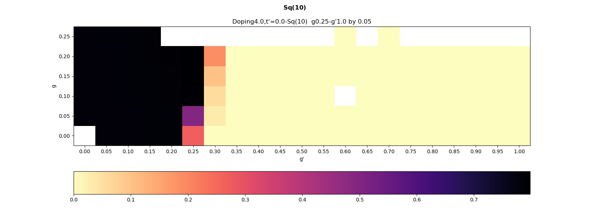
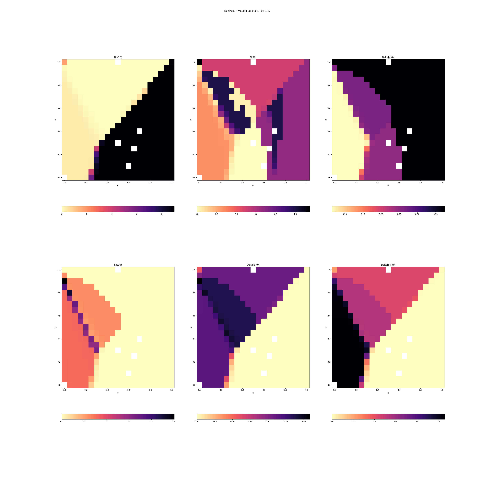
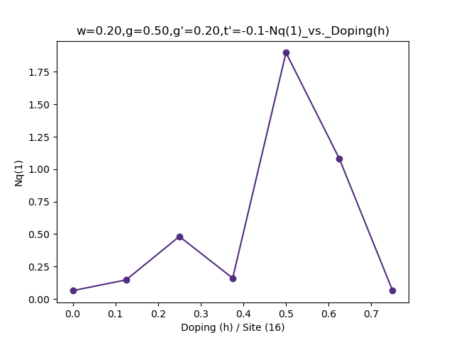
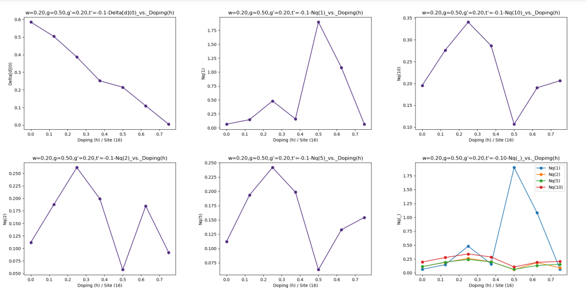
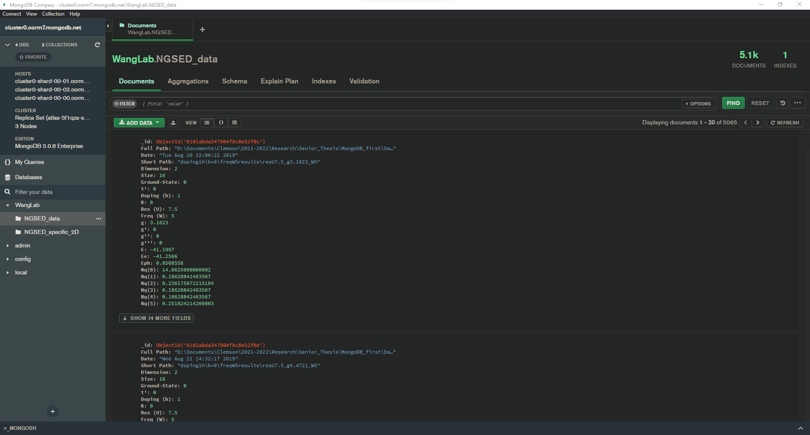

Phonon Database
========================
Author: Matt Myers (Clemson University)
------
Update Date: June 6, 2022

## Function of the codes:
This program is split into three main files:

- `options.py` gives the global program options, the choices decide the length and complexity of the run.
  
- `make_database.py` is the main program that takes in the data, filters out directories that lack information, organize the findings into a dictionary, creates desired figures specified in `options.py`, and finally creates the database using __mongoDB__.

- `data_funcs.py` is the program housing all of the functions utilized in the main program. The combination of `options.py` and `datafuncs.py` allow the main program `make_database.py` to run correctly.

## Input and Output
### Options:
`options.py` gives the global program options, the root directory is where the program will look for the data this is the input for `make_database.py`. The subfolders do not matter just the parent folder. **Note**: there should be a __\\\\__ between directories because one acts as the escape character.
```
# Root directory
rootdir = 'C:\\******\\******\\******\\******\\******\\****\\******'

# Options
cmap = True or False
figs = True or False
upload = True or False
```
The options input file contain the optional aspects of the program. The options are boolean so either *True* or *False* would be the choices.

- `cmap` - the option that tells the main program whether to create a colormap or not
- `figs` - the option that tells the main program whether to create doping versus various parameter graphs
- `upload` - the option telling the main program to either upload the information to the database or not. This is helpful for debugging other aspects of the program.
  
### Input:
All the raw data should be organized into a directory. This directory will be the `rootdir` parameter in the `options.py` file. The program scans through all of the subdirectories so only having the parent folder will work well for this program.  

### Ouput:
Depending on the opitions in `options.py` the output will vary. Below I will show the variety of output expected from the above options. 

- `cmap` = True: This will create a directory named __map_folder__ that contains directories organized by t' and then further by doping. Within these subfolders there will be two of every desired parameter plus two. There will be a `.png` and `.eps` for each parameter plus a set of `.png` and `.eps` that contains all parameters. 
  - Specfic parameter
  - 
  - All together
  - 

- `figs` = True: This will create a directory named __figure_folder__ that contains directories organized by w, g, g', and t'. Within these subfolders there will be two of every desired parameter plus two and a pdf. There will be a `.png` and `.eps` for each parameter plus a set of `.png` and `.eps` that contains all parameters. The pdf has all of the other figures in one image. 
  - Specfic parameter
  - 
  - All together
  - 
  - PDF
  - 

- `upload` = True: This will upload all the data to the choosen __MongoDB__ service. The cloud had previously been in use for ease of access but there is also an easy local option included.
  - 

## Running
### Libraries
__`win32api`__:
```
    pip install pywin32
```
__`certifi`__:
```
    pip install certifi
```
__`pymongo`__:
```
    pip install pymongo
```
__`numpy`__:
```
    pip install numpy
```
__`matplotlib`__:
```
    pip install matplotlib
```
__`fpdf`__:
```
    pip install fpdf
```
### Breakdown
The main code can be broken down into four main parts:

- Filtering data by only finding directories with certain files. These files are neccessary for the program to run correctly.
```
# Filtering criteria 
#   Must include the needed_files and the excluded directories are in blacklist_dir
needed_files =['mylog','nonGaussED_eq_observables.txt', 'observableList.txt', 'varState.txt']
additional_dir = ['observable_name_list.txt','mylog','nonGaussED_eq_observables.txt', 'NGSED_iteration_variables.txt']
blacklist_dir = ['unconverged','without inversion symmetry','__MACOSX', 'NGSvariationalParams',
                 'old correct data', 'WarmUp','old data','withTprData','incompleted', 
                 'data assuming inversion symmetry', 'new','HubbardCal',
                 'U0allk','correct data without Delta','copy','backup']
# Filtering and returning the paths to the correct directories
#   Getting the filtered path information first
print('Searching for directories...')
print(f'Including: {needed_files} and {additional_dir}')
print('Not Including:',  blacklist_dir)
all_paths = df.dir_path_find(needed_files, blacklist_dir, additional_dir)
print("All directories found\n")
```
where the ``EXECUTABLE`` is the target program defined above.

For different machines, one shoud change the definition of compilers and flags. For example, in NERSC where environment has been predefined, one can call ``CC`` as an abstract compiler
```
#!bash
CXX = CC #-std=c++14
FLAGS = -O3 -no-prec-div -static -fp-model fast=2 -xHost -openmp
```
Instead, in TACC one should use specific MPI compiler and ``static`` does not work
```
#!bash
CXX = mpicxx
FLAGS = -O3 -no-prec-div -fp-model fast=2 -xHost -openmp
```
### Dependent libraries
Most of the program is based on Eigen data structure. The ground state calculation (diagonalization) lies in PARPACK dynamic libaray, though an alternative Lanczos class is also provided. The solution of PDE depends on the Odeint libaray in boost.

To compile the code, one should provide the path for Eigen and Boost in the Makefile, together with the link to the dynamics libaray of PARPACK and ARPACK.

Typically, both Eigen and Boost are modules in a supercomputer. One should ``module load eigen`` and ``module load boost`` before compiling the code.  These paths should be provided in the Makefile as
```
#!bash
HEADERLIBS = $(EIGEN3)/eigen3 -I$(BOOST_DIR)/include 
```
The expansion of these paths read as 
```
#!bash
-I/global/common/cori/software/eigen3/3.3.3/include/eigen3 -I/usr/common/software/boost/1.67.0/intel/haswell/include
```
in NERSC (Cori). In contrast, the PARPACK is not necessarily capsulated as a module. If a ``parpack`` module is availabe, one can ``module load parpack`` before compiling the code, and include the paths as
```
OBJLIBS = $(PARPACK)
```
The path reads as
```
-L/usr/common/software/parpack/3.2.0/hsw/intel/lib -larpack -lparpack
```
in NERSC (Cori).

### Run in a supercomputer cluster
A hybrid MPI + OpenMP parallelization has been implemented in the program. To run a hybrid code, please read the instruction of your supercomputer. A typical ``SLURM``submission script looks like (here is the script for NERSC)
```
#!bash
#!/bin/sh
#SBATCH -J JOBNAME
#SBATCH -p debug
#SBATCH --nodes=10
#SBATCH -t 00:15:00
#SBATCH --tasks-per-node=8
#SBATCH --cpus-per-task=8
#SBATCH --constraint=haswell
#SBATCH -e job.err
#SBATCH -o job.out
#SBATCH -V

cd  $SLURM_SUBMIT_DIR
rm job.*
rm *.txt

export OMP_PROC_BIND=true
export OMP_PLACES=threads
export OMP_NUM_THREADS=4
srun ./testNonEquilibriumDynamics >& mylog
```
It is highly recommended to test the parallelization configurations before heavy batch submissions. Timing is embedded in the code, convenient for such test. The MPI communication overhead is typically larger than the shared-memory OpenMP, therefore, maximizing ``OMP_NUM_THREADS`` is recommended for small problems. However, for the construction of Hilbert space, sparse matrix and some observable evaluations, the read/write overhead is also obvious for the shared-memory scheme. A typicall choice of ``OMP_NUM_THREADS`` is about 4-12.

## Architechture of the Program
The general architechture is reflected in the folders. 

The ``Util`` folder contains all global functions, including global classes (MPI related), math functions, string operations and timer. The `LinearAlgebra` folder contains fundamental MPI-based algebra, including the MPI vector operations, MPI eigen-problem solver, MPI linear problem solver, and the Krylov-subspace exponential solver. Both folders are generically designed without physical purposes.

The `PhysDataStruct` folder contains the elementary data structures constitude the exact diagonalization calculation. The main data structures are: 
 
 1. **cluster classes** (including `ClusterReal` and `ClusterReciprocal`) define the geometric relation, size, dimention and symmetries;
 2. **Hilbert space class** (including the basis element `BasisState` and the entire Hilbert-space class `HilbertSpace`) defines the many-body basis, relavant Fock-space operations, and the space-level operations;
 3. **Hamiltonian matrix class** -- template `HamiltonianMatrix`, consistes of the bottom-level matrix decomposition and matrix-vector product, as well as the high-level matrix construction based on Hamiltonian terms;
 4. **many-body state and operations** (including `ManyBodyState`, `ManyBodyOperator` and `VariationalState`) define the wavefunctions and many-body operations. 

The `MeasureEngines` folder contains high-level exact diagonalization calculations of observables, spectroscopies and dynamics. These classes are directly called by the main function to realize (separately or jointly) a physical purpose. The main data structures are: 

 1. **equilibrium engine** (including pure ED `EquilibriumEngine` and variational + ED `EquilibriumVariationalEngine`) sets up the calculation for ground state and low excited states.
 2. **equilibrium spectroscopy engine** (including `EqSpectrum` and `CPTSpectrum`) sets up the calculation of spectroscopies at equilibrium. It relies on `SpectraParams` as an input of spectral type and energy/momentum range.
 3. **nonequilibrium dynamics engine** -- `NonEqTimeEvolution` calculates the time evolution of an initial wave function after applying a pump field. Observable engine is embedded to measure the instantaneous properties.
 4. **nonequilibrium spectroscopy engine** -- `NonEqSpectrum` measures the time-dependent pump-probe spectroscopies. As an extension of both spectroscopy and nonequilibrium dynamics, it takes the input from both wavefunction dynamics and spectral parameters.

Apart from these four main data structures, there are two measurement engines which does not work separately and is embedded in other engines
 1.  **observable engine** -- ``ObservableEngine`` defines all single-time measurements based on any given wavefunctions. The input/output and reduction operations are embedded in this class. The observable engine is called in other measurement engines.
 2. **ensemble engine** (including `EnsembleObservables` and `EnsembleSpectra`) measures ensemble-based properties using multiple excited states.


### Spectral Engines

For example, the `Nqw` option triggers the calculation of dynamical charge structure factor $N(\mathbf{q},\omega)$, defined as
$$
N(\mathbf{q},\omega) = \frac1\pi \mathrm{Im}\langle G | \rho_{-q} \frac1{\mathcal{H} - E_G - \omega - i\delta} \rho_q |G\rangle
$$